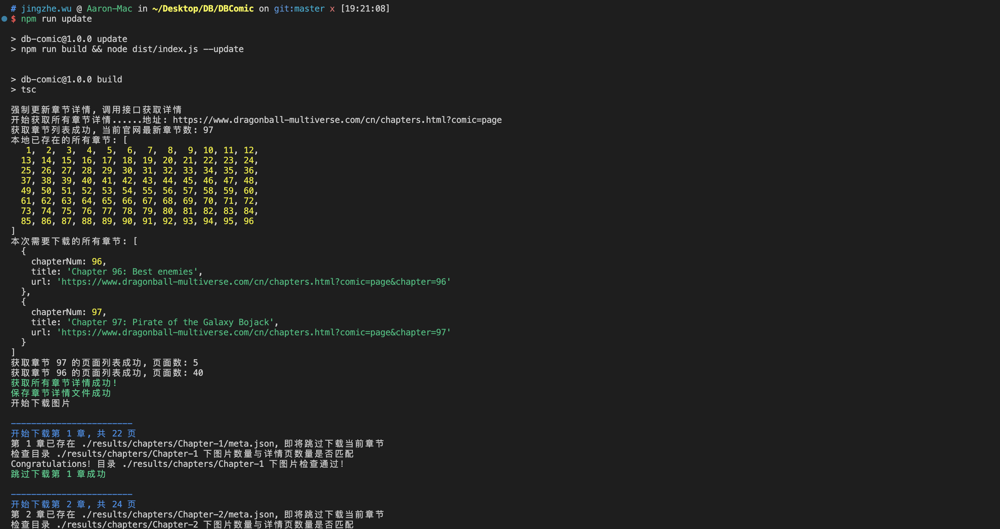
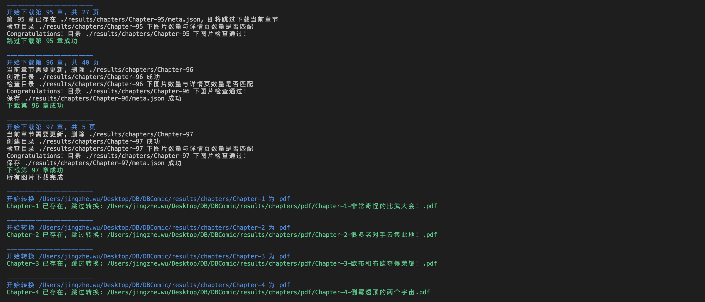
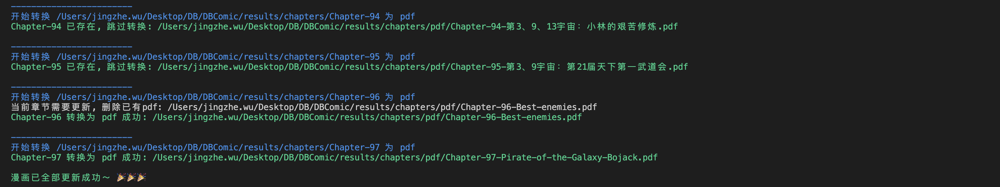

# db-comic

一个用来爬取《龙珠超次元乱战 DragonBall Multiverse》漫画的脚本，可以自动下载官网的图片并生成PDF文件保存到本地。

支持增量下载，如果本地已经有了部分章节，可以只下载新的章节，避免重复下载。

## 使用方法

### 1. 安装依赖

```bash
npm install
```

### 2. 首次下载

```bash
npm run download
```

适用于第一次下载，之后再次运行时，不会从官网获取最新的章节

### 3. 更新漫画

```bash
npm run update
```

适用于已经下载过一次，之后再次运行时，会从官网获取最新的章节，然后下载新的章节

### 4. 运行效果



......



......



### 5. 查看漫画

生成的PDF文件在`./results/chapters/pdf`目录下，可以使用PDF阅读器打开。
同时，也在`./results/chapters/`下，也会包含所有章节的图片文件，可以直接查看，比如`./results/chapters/Chapter-1/Page-3.jpg`

## 注意事项

### 1. 下载图片失败

偶现一些章节的漫画图片下载失败或者卡死，可以`Ctrl + C`终止，然后重新运行脚本即可

### 2. 生成PDF失败

目前发现第41章，[916这张图片](https://www.dragonball-multiverse.com/cn/page-916.html)有问题，导致这个章节生成PDF的时候卡死。

临时的解决方法是，手动对下载好的`./results/chapters/Chapter-41/Page-916.jpg`进行截图，然后替换掉这张图片，再重新运行脚本即可。

一旦生成了PDF，后续更新漫画的时候就不会再重新生成，所以这是个一次性的操作，不需要每次都手动替换。

### 3. 生成的PDF文件的页面的长宽比例

由于不同图片的长宽比例不一样，绝大部分的图片都是高度大于宽度，所以生成的PDF文件的页面大小是`A4`纵向。

对于少部分宽度大于高度的图片，会对图片进行旋转90度，防止图片变形，比如[这张](https://www.dragonball-multiverse.com/cn/page-8.html)。

但是对于极少部分比例特别奇怪的图片，比如[这张](https://www.dragonball-multiverse.com/cn/page-2273.html)（太长了），在生成PDF的时候会被压缩到`A4`纵向的页面内，导致图片变形，这个问题暂时没有比较好的解决方法，如果有好的解决方案，欢迎提出PR。

## 说明

- 本项目仅供学习交流使用，方便大家阅读漫画，不得用于商业用途
- 官网地址：[《龙珠超次元乱战》](https://www.dragonball-multiverse.com/cn/chapters.html?comic=page)，请大家多多支持漫画作者
- 欢迎提出建议和改进意见，以及Issues和PR
